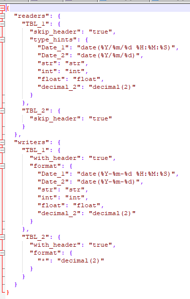
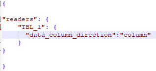
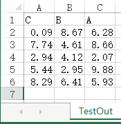

# ExcelTransformer
an util for transforming the excel file

功能简介
========

该模块主要用于把在Excel中各个位置的数据抽取转换并加载到指定的目标文件。该模块主要包含两个部分的功能，一个是命令行工具
“xl_transform”，另一个是提供 excel
内容抽取的API。命令行工具主要用于直接通过模板文件把分步在一个excel中的不同数据抽取出来，并按照输出的模板，把数据输出到指定的excel文件中。该模块提供的API有两个主要的功能，一个是用于把对应区域的
excel 内容抽取称为 pandas 的 DataFrame，另一个是把 DataFrame 输出到 excel。

下图是该模块的简介图：

使用说明
========

命令行工具使用示例
------------------

在项目的 “doc/demo”中有对应的实例文件。

其中 SourceTemplate.xlsx 是定义数据源抽取抽取方式的模板文件。其内容如下：

OutputTemplate.xlsx 文件是定义数据输出位置的模板文件，其内容如下:

Config.json 文件是控制抽取时的行为，比如说“是否调过
header对应的行”或者“限制抽取数据的行数”。其内容如下：

在文件夹中 Source.xlsx 是源数据的Excel，其数据如下：

接着使用该项目提供的命令行工具 “xl_transform”
进行excel数据的抽取。该文件位于项目的“bin” 文件夹内。我们在 demo
的文件夹中执行如下命令，就能够将“Source.xlsx”中的数据抽取到 “TestOut.xlsx”中。

执行完该命令后，我们会发现 demo
文件夹中生成了结果文件”TestOut.xlsx”。其结果如下：

输入模板文件
------------

### 定义数据起始区域

输入模板文件主要是用于控制程序从 excel
的哪个位置抽取数据。下面我将通过一个简单的实例讲解输入模板文件的用法。

这个模块通过 ”\${\<area name\>:\<data column name\>}”
这样的模式来识别需要抽取数据区域的起始位置。其中 ”area name”
是指对某一个数据区域的命名，每个模板文件中该名称必须唯一。另外 ”data column
name”
表示对某一列数据的命名，每一列的命名在每个数据区域中必须唯一。需要注意的是，该模块是通过数据区域的起始位置以及起始位置单元格所在的
sheet 来定位数据区域，所以模板中的 sheet 名称要和数据源 excel 对应的 sheet
的名称要相同。

下图是一个简单的例子，图中红色长方形方框所在的两个区域，代表了要从 “TestSheet”
中提取的两个数据区域的起始位置。其中命名为 ”TBL_1”
的数据区域起始位置的单元格是横向排列的，这代表数据区域中的每一行都是横向排列的，而数据抽取方向则是自上而下进行抽取。命令为
“TBL_2” 的数据区域是纵向排列的，这代表数据将从左往右按列进行抽取。

模板文件中同一个数据区域的起始位置只有是连续的一行或者一列的才会被认为是合法的，下面的图片将展示一些不合法的起始位置。

### 自动使用数据区域中的表头作为数据列的表头

该模块提供一个便捷命名数据列的功能，就是使用已有的表头作为数据列的表头。当使用
”\${\<area name\>:_}”
的形式定义起始位置时，该模块会自动使用数据源中对应单元的值作为数据列的表头。并且该模块支持混合使用自定义表头和自动提取表头。下面的例子中，提取区域的第一二三列将使用自定义的数据列名，第四五列将使用数据源中的值作为数据列名。

### 定义单行或单列数据区域

当一个数据区域需要从一行或者一列中提取数据时，该模块无法从起始位置中检测出数据提取的方向，此时有两个方式使得系统能够识别出数据提取的方向，一个是通过控制文件中定义属性
“data_column_direction”
告诉系统该数据区域的数据提取方向，另一种是在起始位置中多定义一个单元格使得系统能够自动识别出数据提取的方向。

下面的示例将展示使用 “data \_ column \_direction” 属性控制数据提取的方向。

模板文件的内容

控制文件的内容

下面的示例将展示使用 冗余数据列控制数据提取的方向。该示例中我们添加多一列 “B”
，使得系统能够识别出应该从上往下提取数据，另外由于该模块提供数据投影的功能，即可以只写入对应数据列的内容到目标
excel 文件中。

输出文件模板
------------

和出入模板文件类似，不同的是输出模板文件是用于控制数据输出位置。在定义数据起始区域和输入模板文件定义的方式相同，详情请见：*定义数据起始区域*。

### 输出模板文件的数据投影功能

我们可以通过输出模板文件选择要输出的数据列，或者重新定义数据列的摆布顺序。比如我们从源文件中的一个数据区域提取出一个包含
”A” \~”E” 列的数据。只输出其中的 “A” \~ “C” 列。并这 “A” \~ “C”
列可以以任意顺序排列在起始位置中。

下面的例子将更加详细地展示这个功能：

1.  首先我们从源文件提取到如下的数据：

1.  接着我们使用如下的输出模板文件：

1.  我们将在输出文件中得到如下内容：

### 输出区域检查功能

该模块提供对数据输出区域检查的功能，当两个不同的数据区域出现相交的时候就会报错。以下是简单的示例将演示这一功能。

1.  首先我们从源获取到如下的数据：

1.  然后我们使用如下的输出模板文件：

1.  我们可以很明显地看出，这两个数据输出区域将会如下图所示产生重叠：

1.  此时就会报如下的错误，防止数据被意外地覆盖。

控制文件
--------

控制文件是一个 JSON
格式的文件，主要用于控制模块在读取数据或者写入数据时的一些行为。该文件的格式如下，其中
“readers” 配置的是和数据读取有关的属性，”writers” 配置的是和数据输出有关的属性:

### 控制数据读取行为的属性

#### “skip_header”

该属性用于控制在读取数据时，是否跳过起始位置所在的单元格。可以接受的值有，true,false
或者字符串形式的 “true”,”false”。该属性的默认值为 true
，即默认跳过起始位置所在行。

下面的示例将演示该属性的作用：

1.  首先假设我们有如下的一个源文件，其内容如下。

1.  然后我们使用如下的输入模板文件，提取该文件。

1.  下面两幅图片将分别展示 “skip_header” 取 true 或者 false 时，数据提取的结果。

#### “rows_limit”

该属性主要用于控制数据读取的行数。可以以数字或者字符串的形式输入正整数表示限制数据读取的行数。当没有定义该属性时，该模块会以最后一行数据全部为空作为条件截取数据。下面的示例将展示是否定义了
“rows_limit” 对读取行为的影响。

1.  首先我们有如下的数据源。

1.  我们使用如下的输入模板文件进行读取。

1.  当我们使用了 “rows_limit” 属性为3时，我们将得到如下的结果。

1.  当我们没有定义 “rows_limit” 属性时，我们将得到如下的结果。

#### “data_column_direction”

该属性主要用于当只需要提取单行或者单列数据时，使用该属性限定数据读取的方向。该属性只能输入
“row” 或者 “column”。当输入为 “row”
时，表示数据列中的数据是以行的形式分布在源文件中，所以会从左到右提取数据。当输入为
“column”
时，表示数据列中的数据是以列的形式分布在源文件中，所以会从上到下提取数据。

#### “type_hints”

该属性用于控制数据在内存中以什么形式存在，该属性主要在以“以API形式使用该模块”或者“需要格式化输出的时候”才会有比较大的作用。当没有定义该属性时，该模块会使用
excel 中的格式作为数据在内存中的数据类型格式。

目前主要支持转换到三种目标类型，分别是 str, datetime 和 Decimal。

**转换到“str”:**

格式：str(\<format string\>)

例子： 使用 “str({:.2f})”进行转换，则当输入为 1.234时，该模块将以字符串 “1.23”
的形式存储对应单元格的数据。

详细有关如何格式化各种数据，请看: Python3字符串格式化教程 和 Python3 format
string syntax (Official Document)。

**转换到“Decimal”:**

格式：decimal(\<integer string\>) 其中的整数表示 Decimal 存储小数的位数。

例子： 使用 “decimal(2)”进行转换，则当输入为 1.234时，该模块将以Decimal (“1.23”)
的形式存储对应单元格的数据。

需要注意的是，当数据源为 float 类型的并且定义的 decimal
类型长度过长，则过长的部分的数值将会不准确。比如使用 “decimal(20)” 转换 1.1
将会得到如下结果：” Decimal('1.10000000000000008882')”。

**转换到“datetime”:**

格式：date(\<format string\>)

例子： 使用 “date(%Y/%m/%d)”进行转换，则当输入为
“2018/12/31”时，能得到正确的datetime实例。

详细有关如何格式化解析时间日期类型的数据，请看: *Python3
日期和时间教程*和*Python3 datetime format syntax (Official Document)*。

### 控制数据输出行为的属性

#### “skip_header”

该属性控制输出时是否包含表头。在没有定义该属性时，默认输出表头.

#### “rows_limit”

该属性用于限制数据输出的行数。

#### “data_column_direction”

该属性用于控制在只输出一行或者一列的情况下，在同一列中的数据在目标文件中分布的方向。当该值为
“column” 时，表示数据会从上往下分布，当该属性为 “row” 时表示数据会从左往右分布。

#### “formats”

该属性用于控制数据输出到 excel 文件中的格式。

**输出成“文本”:**

格式：”str(\<format string\>)”

示例：使用 ”str({.3f})” 格式化 1.23，将会在对应单元格输出
1.230，并且对应单元格的类型为“文本”类型。

详细有关如何格式化各种数据，请看: Python3字符串格式化教程 和 Python3 format
string syntax (Official Document)。

**输出成“数字”:**

格式：decimal(\<integer string\>) 其中的整数表示 Decimal 存储小数的位数。

例子： 使用 “decimal(2)”格式化 1.234时，将会在对应的单元格输出 1.23
，并且单元格的类型为 “数字”类型。

**输出成“日期”:**

格式：date(\<format string\>)

例子： 使用 “date(%Y/%m/%d)”格式化 “2018/12/31 00:00”时，对应的单元格将输出
“2018/12/31” 并且，对应单元格类型为日期类型。

详细有关如何格式化解析时间日期类型的数据，请看: *Python3
日期和时间教程*和*Python3 datetime format syntax (Official Document)*。

API 工具
========

“FileReader”
------------

使用该FileReader类的read方法，提供数据源文件路径，输入模板文件路径以及配置文件路径，可以从数据源中读取数据并且输出一个
dict，其中 key 是数据区域的名称，value 是读取到的数据，其类型为 DataFrame 。

方法签名为:

FileReader.read(source_path:str,template_path:str,config_path=None:str) -\>
dict[str,DataFrame]

“FileWriter”
------------

使用 FileWriter
的write方法，提供输出文件路径，输出模板文件路径，需要输出的数据，以及配置文件路径，即可把数据按照指定的格式和位置输出到指定文件中。其中需要输出的数据是dict，其中
key 是数据区域的名称，value 是读取到的数据，其类型为 DataFrame 。

方法签名为:

FileWriter.write(target_path:str,template_path:str,data:dict[str,DataFrame],config_path=None:str)
-\> None

附录
====

1.  *Python3字符串格式化教程*

2.  [Python3 format string syntax (Official
    Document)](https://docs.python.org/3/library/string.html#format-string-syntax)

3.  [Python3
    日期和时间教程](http://www.runoob.com/python3/python3-date-time.html)

4.  [Python3 datetime format syntax (Official
    Document)](https://docs.python.org/3/library/datetime.html#strftime-and-strptime-behavior)
